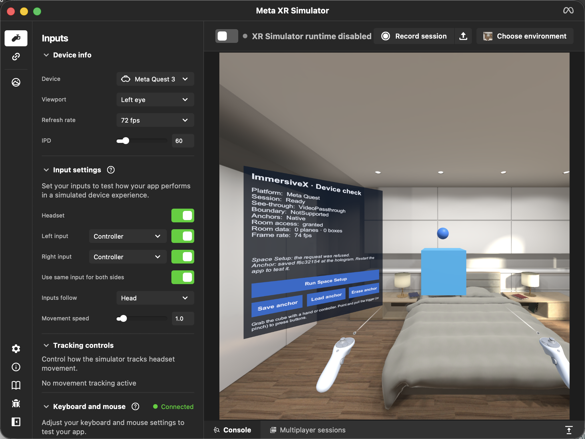

# Meta Quest

**Status:** preview · **Adapter:** `Platforms/MetaQuest` (`com.immersivex.platform.metaquest`)
**Devices:** Quest 3 and 3S (full mixed reality), Quest Pro and Quest 2 (passthrough; Space Setup is manual, with no automatic mesh).

## What you need
| | |
|---|---|
| Unity | 6000.3.23f1 with **Android Build Support**, **Android SDK & NDK Tools** and **OpenJDK** |
| Headset | Developer Mode on (set in the Meta Horizon phone app; needs a Meta developer organisation), USB debugging allowed |
| Cable | USB-C cable that carries data |
| Tested on | Quest 3, Horizon OS v207 (Android 14) |

## Pinned versions
| Package | Version |
|---|---|
| OpenXR Plugin | 1.18.0 |
| Unity OpenXR: Meta | 2.3.2 (brings XR Composition Layers 2.5.0) |
| ImmersiveX Core | 0.1.0 (AR Foundation 6.3.5, XRI 3.3.2, XR Hands 1.7.3) |

## Set up and build
1. **ImmersiveX ▸ Platform Setup ▸ Meta Quest ▸ Install.** Wait for the Package Manager and compilation to finish.
2. **Configure.** This sets:
   - **Player:** IL2CPP, ARM64, Vulkan only, Android API 32 minimum / 34 target, ASTC textures.
   - **XR:** the OpenXR loader for Android, and the **Meta Quest feature set**, enabled the way the Project Settings checkbox does it. That also turns on its required **Composition Layers Support**; without it passthrough never draws and you see black. Enabled Meta Quest features: Session, Camera (Passthrough), Planes, Bounding Boxes, Anchors, Raycasts and Boundary Visibility. ImmersiveX hides the boundary once passthrough is showing, because the feature's own start-up request fails with `XR_ERROR_HANDLE_INVALID`.
   - **Input:** Hand Tracking, Meta Hand Tracking Aim, and the Oculus Touch, Quest Touch Plus and Hand Interaction profiles. Latency optimisation is set to *Prioritize Input Polling*.
   - **URP:** HDR, terrain holes and post-processing off; intermediate texture set to *Auto*, which passthrough needs.
   - **Rig samples:** imports the XR Interaction Toolkit rig samples if they're missing.
3. **Build.** The APK is written to `Builds/metaquest/ImmersiveX.apk`. Building never installs anything.

Command line (with the editor closed):

```sh
"/Applications/Unity/Hub/Editor/6000.3.23f1/Unity.app/Contents/MacOS/Unity" -batchmode -quit -projectPath . \
  -buildTarget Android -executeMethod ImmersiveX.Editor.BuildCli.Build -platform metaquest
```

## Test in the Meta XR Simulator (no headset)
1. Install the [Meta XR Simulator](https://developers.meta.com/horizon/documentation/unity/xrsim-intro) app. On macOS it goes to `/Applications/MetaXRSimulator.app`; elsewhere, use **ImmersiveX ▸ Play Mode ▸ Locate Meta XR Simulator…**.
2. **ImmersiveX ▸ Play Mode ▸ Meta XR Simulator (Quest)**, then press **Play**. The simulator window shows your content over a simulated room. The first time, close its welcome dialog.
3. Switch back with **ImmersiveX ▸ Play Mode ▸ XR Simulation (any device)**.

What the simulator can and can't check (Meta XR Simulator 205 with Unity OpenXR: Meta 2.3.2, tested 2026-09-26):

| Check | Simulator | Why |
|---|---|---|
| Quest detected, start-up flow, content placement | ✅ | |
| Passthrough (simulated room behind content) | ✅ |  |
| Controllers, device panel, frame rate | ✅ | |
| Save an anchor | ⚠️ | Only the first save of each run works. Later saves hit the same `xrGetSpaceComponentStatusFB` rejection (checked 2026-09-28); content falls back to the pose saved with the room |
| Load a saved anchor | ❌ | The simulator rejects `xrGetSpaceComponentStatusFB` (`XR_ERROR_VALIDATION_FAILURE`) and tries cloud discovery |
| Room planes / furniture | ❌ | Same `xrGetSpaceComponentStatusFB` rejection, so planes are dropped |
| Space Setup | ❌ | The runtime doesn't offer `XR_FB_scene_capture` |
| Boundary hiding | ❌ | The runtime doesn't offer `XR_META_boundary_visibility` |
| Meta hand-aim poses | ❌ | The runtime doesn't offer `XR_FB_hand_tracking_aim` |

Everything marked ❌ is checked on the headset.

## Install and run
- **Unity:** **ImmersiveX ▸ Platform Setup ▸ Meta Quest ▸ Build And Run**, with the headset connected and awake.
- **adb** (bundled with Unity):
  ```sh
  ADB="/Applications/Unity/Hub/Editor/6000.3.23f1/PlaybackEngines/AndroidPlayer/SDK/platform-tools/adb"
  "$ADB" install -r Builds/metaquest/ImmersiveX.apk
  "$ADB" shell monkey -p genxr.immersivex.app -c com.oculus.intent.category.VR 1
  "$ADB" logcat -s Unity   # ImmersiveX messages start with [ImmersiveX]
  ```
- In the headset, the app appears under **Library ▸ Unknown sources**.

## What happens on first launch
1. Quest asks for permission to use **spatial data** (`USE_SCENE`). Allow it, or room data stays unavailable.
2. Passthrough comes on and the boundary is hidden.
3. Once the headset is on and tracking, the **Hello Hologram** cube appears about 80 cm in front of you, with the **Device check** panel on your left.

## Room mapping (M2)
- **Room Quest already knows** (Space Setup done): ImmersiveX saves it automatically on first launch. A short "Room saved" note appears, and the walkable area is outlined on the floor for 6 s.
- **Known room:** loaded silently, with no prompt.
- **Unmapped room:** a short briefing that starts Space Setup by itself after 5 s (or tap **Start now** / **Skip**). When Space Setup returns, the room is saved automatically.
- **Walkable area** = floor inside the walls, minus a 0.3 m margin. Furniture isn't subtracted.
- **Classification** (floor, walls, furniture) comes from Quest's Space Setup labels. ImmersiveX runs no ML model; it does light geometry once, then pauses room tracking.
- **Panel buttons:**
  - **Rescan room** runs Space Setup and updates the room.
  - **Forget room** deletes ImmersiveX's saved copy; Quest's own Space Setup is untouched.
  - **Show area** redraws the outline.
- Saved rooms live in `Android/data/genxr.immersivex.app/files/ImmersiveX/spaces/`.

## Media (holograms, splats, models, video)
- **Build order:** the **3.5D Xperience** demo scene is first in the build, then `Main.unity`.
- **Any content:** add Immersive Media objects to a scene, each with its own controls and handles. See the [Immersive Media guide](../media.md).
- **Bandwidth:** the 3.5D Xperience's base quality needs about **24 MB/s**, so use fast Wi-Fi (Wi-Fi 6 near the router). If it keeps showing *Buffering*, the link is too slow. The status line, logged every 10 s, shows the download rate.
- **Sound:** plays through Android's MediaPlayer. The build requires the INTERNET permission, which the configurator sets.
- **Splat budget:** big splat scenes keep their 400,000 most visible splats on the headset. Set **Max Gaussians** to change that.

## Device checklist
| Check | How | Expected |
|---|---|---|
| Passthrough | Look around | The real room is visible behind the cube |
| No boundary | Walk around the room | No boundary grid or "return to boundary" warning; the panel shows **Boundary: Hidden** |
| Controllers | Grip button on the cube | It moves with the controller and stays where released |
| Hands | Put the controllers down; pinch or grab the cube | Same as controllers |
| Space Setup (S1) | Press **Run Space Setup**, complete it | The app pauses, then resumes; the panel shows planes and boxes |
| Anchor save (S2) | Move the cube, press **Save anchor** | A blue marker appears above the cube |
| Anchor after headset off/on (S2) | Take the headset off for 10 s, put it back on | The marker hasn't moved |
| Anchor after restart (S2) | Quit the app fully, relaunch | The marker reloads in the same real-world spot |
| Frame rate | Panel | 72 fps or better |
| Hologram (3.5D) | Launch, press **Play** | At the room's centre, 1.6 m tall, with sound; no *Buffering* after the first second |
| Several pieces of media | A scene with more than one Immersive Media | Each stands in its own spot around the centre, facing you, with its own controls |
| Handles | Drag the move bar, a turn bar, the resize corner | It slides across the floor, turns only about the up axis, and resizes; the panel follows moves but not turns |
| Stays put | Move, turn and resize something; take the headset off for 10 s and put it back on; quit fully and relaunch | It never moves by itself; after the relaunch it's back where you left it, and the log says `placed at its spatial anchor` |
| Zebra (4D) | Press **Play** on the zebra with Wi-Fi off | It plays from inside the app: 1.35 m tall, 30 fps, no *Buffering* |

Record results in `docs/validation/`.

## Troubleshooting
| Symptom | Fix |
|---|---|
| Black background instead of the room | Run **Configure** again. It enables the Meta Quest feature set, including **Composition Layers Support**, which passthrough is drawn through, and sets URP HDR off and the intermediate texture to Auto. **Platform Setup ▸ Configure** reports it as an error if Composition Layers is still off |
| Panel shows "Platform: Unknown platform" | The Quest adapter didn't detect the headset. Check `adb logcat -s Unity` for the line starting `Meta Quest adapter inactive:` |
| Room data shows "–" or 0 | Allow spatial data: Settings ▸ Privacy ▸ App permissions, or reinstall. Run Space Setup once |
| Boundary still visible | Passthrough must be showing before the boundary can be hidden. Check `adb logcat -s Unity` for `[ImmersiveX]` boundary messages |
| `adb devices` shows `unauthorized` | Put the headset on and accept **Allow USB debugging** |
